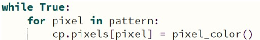
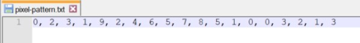

# CPX Light Pattern 2

### Introduction
This lab is a continuation of the previous lab. Instead of hard coding the list of pins inside the
Python program, the pins in the pattern will be read from a file stored on your CPX. Before
entering the process loop (the while loop), the contents of the file should get read into a list.
This list is then accessed in the process loop to flash the lights in the pattern.
The ‘randint’ function is also used to create the actual light displayed.

### Procedure
- Your code should include the following:
  - Read the contents of a file into a list
  - Use the list of pins read from a file as the pattern list from the previous lab
    - When the line of text is read, it should be converted to a list using the ‘split’ method
    - Make sure the split text is correct. The sample file below actually needs to be split using ‘, ‘
    - The digits read in will be characters and need to be converted at some point to integers to be used as index values!
  - Use the function that returns a tuple with the red, green and blue values randomly to create the color of each pixel
    - Don’t forget to import the ‘random’ library!
    - 
    - Don’t forget to do green and blue!!
  - Inside the infinite ‘while’ loop use a ‘for’ loop to iterate through the pattern list
    - 
  - Inside the ‘for’ loop the specific pixel should be turned on using the randomly generated color
    - This is a flash action, so it should then be turned off by setting the pixel to
black as in previous labs
- Sample text file:
  - 
- Check out this [video](https://www.youtube.com/shorts/pOfU9OEm_HA) for an example

### Turn-in
- Upload your working code to the repo
- Upload a short video demonstrating the flashing lights (If remote)

### Grading
- Proper use of comments
- Read the file contents into a list
- Include the function which returns the tuple with three random values between 0 and 255
- Final working project
- Video demonstrating working project (If remote)
